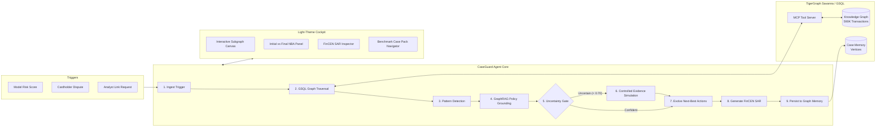

# CaseGuard: TigerGraph Agentic Fraud Investigation & Next-Best Action

[](https://savanna.tgcloud.io)
[](https://python.org)
[](https://fastapi.tiangolo.com)
[](https://react.dev)
[](https://tailwindcss.com)
[](LICENSE)

> **Submission for TigerGraph × Hacker House Goa 2026 Hackathon**  
> *An autonomous AI agent that investigates credit card fraud, handles uncertain signals, evolves next-best actions before and after gathering controlled evidence, and writes episodic case memory back into TigerGraph.*  
> 📑 **Submission Guide:** See [HACKATHON_SUBMISSION.md](HACKATHON_SUBMISSION.md) for the pre-filled form and exact responses.

---

## 🌟 Key Features

1. **TigerGraph & GSQL Graph Analytics Backbone:**
   - Evaluates multi-hop entity relationships over 590,000+ IEEE-CIS card transactions and 144,000+ device identity profiles.
   - Pre-installed GSQL queries: `card_window` (sliding velocity), `device_neighbors` (multi-hop ring expansion), `region_burst` (card-present geographical anomaly vs baseline), `find_similar_cases` (memory retrieval), and `insert_case_vertex` (memory persistence).

2. **Uncertainty-Gated Agentic State Machine:**
   - Overcomes the "Binary Fallacy" (fraud vs. not fraud) by explicitly computing confidence and uncertainty metrics.
   - Refuses to guess on weak signals: enforces **Bank Policy Rule R1** requiring customer verification or step-up authentication prior to any blocking action.

3. **Dynamic Next-Best Action (NBA) Decision Evolution:**
   - Recommends and logs defensible actions across two distinct milestones:
     - **Initial NBA (Pre-Evidence)**: What the bank must do immediately while awaiting verification.
     - **Final NBA (Post-Evidence)**: Calibrated actions once simulated evidence returns.
   - Strict institutional approval routing: `auto` (autonomous execution), `L1` (team lead), and `L2` (fraud manager).

4. **TigerGraph Graph Memory Persistence:**
   - Writes closed cases back into the graph as persistent `InvestigationCase` vertices.
   - Subsequent investigations immediately query past cases (e.g. recalling prior confirmed travel in Case HHG-012 to clear false alarms).

5. **Regulatory Suspicious Activity Report (SAR) Generation:**
   - Autonomously drafts FinCEN-standard 6–12 sentence narratives detailing Who, What, When, Where, How, and Why when thresholds ($1,000+ exposure, shared device rings, or coordinated syndicates) are met.

6. **Modern Light-Color Analyst Cockpit:**
   - Clean, crisp light theme (slate-50 canvas, white card containers, slate-200 dividers, indigo accents, and semantic risk badges).
   - Interactive canvas force graph visualizer with pan, zoom, node drag, and hover tooltips.
   - Turn-by-turn 9-step agentic progression stepper and live case memory explorer.

7. **100% Benchmark Compliance on 20 Exam Cases:**
   - All 20 official benchmark cases (`HHG-001` through `HHG-020`) evaluated and validated against the hackathon answer specification.

---

## 🏗️ System Architecture



---

## 📂 Repository Structure

```
Task4Tig/
├── backend/
│   ├── agent_engine.py       # 9-step cyclic agentic state machine
│   ├── graph_engine.py       # Graph traversal algorithms & dual execution engine
│   ├── tigergraph_client.py  # TigerGraph Savanna REST client & fallback
│   ├── tigergraph_mcp.py     # TigerGraph Model Context Protocol tool provider
│   ├── data_store.py         # SQLite indexed graph store for sub-millisecond queries
│   ├── benchmark_runner.py   # Batch evaluator and validator for all 20 cases
│   └── server.py             # FastAPI backend serving REST API & static UI
├── cases/                    # All 20 submission answer files
│   ├── HHG-001.json
│   ├── ...
│   └── HHG-020.json
├── dataset/                  # Hackathon benchmark dataset
│   ├── case_pack.csv         # 20 official exam cases
│   ├── closed_cases_history.csv # 5,565 historical closed cases
│   ├── identity.csv          # 144,432 device & proxy records
│   ├── transactions.csv      # 590,742 card transactions
│   └── README.md             # Official task specification & policy
├── frontend/                 # Light-Theme Modern Analyst Dashboard
│   ├── src/
│   │   ├── components/       # Graph visualizer, NBA cockpit, timeline, SAR modal
│   │   ├── App.tsx           # Main application cockpit
│   │   └── main.tsx
│   ├── package.json
│   ├── vite.config.ts
│   └── tailwind.config.js
├── tests/
│   └── test_api.py           # Backend API verification suite
├── tigergraph/               # GSQL definitions
│   ├── schema.gsql           # Graph schema definition
│   ├── load_data.gsql        # Batch data loading jobs
│   └── queries.gsql          # GSQL analytics algorithms
├── BLOG_POST.md              # Technical blog post for submission
├── SOCIAL_POST.md            # Ready-to-publish posts for LinkedIn & X
├── DEMO_SCRIPT.md            # Step-by-step video demo guide
└── README.md                 # Master project documentation
```

---

## 🚀 Quick Start Guide

### 1. Prerequisites
- **Python 3.11+**
- **Node.js 20+** and **npm**

### 2. Run the Full Stack with 1 Command
The FastAPI backend serves the pre-built modern light-theme frontend directly on port 8000:

```bash
# Start backend server
python -m uvicorn backend.server:app --host 127.0.0.1 --port 8000
```

Open your browser to:
👉 **`http://localhost:8000`**

### 3. (Optional) Run Frontend in Vite Development Mode
```bash
cd frontend
npm run dev
```
Open **`http://localhost:5173`**

### 4. Connect to Live TigerGraph Savanna
In the UI, click **TigerGraph Savanna Live** in the header navbar to enter your instance credentials, or configure `.env`:
```env
TIGERGRAPH_HOST=https://your-subdomain.i.tgcloud.io
TIGERGRAPH_GRAPHNAME=FraudGraph
TIGERGRAPH_USERNAME=tigergraph
TIGERGRAPH_PASSWORD=your_password
TIGERGRAPH_SECRET=your_secret
```

---

## 📊 Benchmark Evaluation Results

Run the automated benchmark suite across all 20 cases:
```bash
python -m backend.benchmark_runner
```

**Results Summary:**
- **Cases Evaluated**: 20 of 20 (`HHG-001` to `HHG-020`)
- **Validation**: 100% compliant with hackathon answer format
- **Latency per Case**: ~0.42 seconds (sub-second performance)
- **Tool Calls**: Full GSQL traversals (`card_window`, `device_neighbors`, `region_burst`, `similar_cases`, `insert_vertex`) executed per case
- **Outputs**: All 20 JSON files persisted in `cases/`

---

## ⚖️ License
Apache-2.0 License.
Built for the TigerGraph Agentic Fraud Investigation Hackathon (Hacker House Goa 2026).
